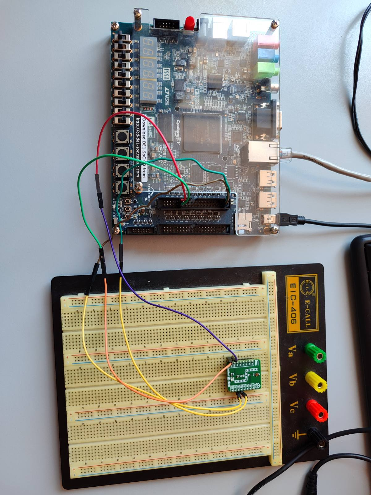

# VEML6035 ambient light sensor integration and lighting control on DE1-SoC

This project was developed as part of the **Embedded Computer Systems** (*Ugrađeni računarski sistemi*) course at the **Faculty of Electrical Engineering, University of Banja Luka (ETFBL)**.

## Project Assignment & Requirements

Integrate the ambient light measurement sensor, available on the Ambient 11 Click board (integrated circuit VEML6035), onto the DE1-SoC platform. Implement an application that enables adaptive room lighting control based on the information received from the given sensor.

## Hardware Setup

Required hardware:
- DE1-SoC development board with power supply and UART cable.
- Ambient 11 Click (VEML6035) board.
- SD card.
- Ethernet cable (for SSH connection).
  
### Connecting Ambient 11 Click to target board

The pin layout and hardware schematics can be found in the [DE1-SoC Schematic Diagram](https://people.ece.cornell.edu/land/courses/ece5760/DE1_SOC/DE1-SoC%20schematic.pdf) and the course User Manual provided by the professor (`hps-soc-system.pdf` in docs). 
The sensor pins are connected to the GPIO 0 expansion header as shown in the table below:
| Sensor Pin (Ambient 11 Click) | GPIO 0 Header Pin | Description |
| :--- | :--- | :--- |
| **VCC** | **Pin 29** | Power Supply (3.3V) |
| **GND** | **Pin 30** | Ground |
| **SDA** | **Pin 1** | $I^2C2$ Serial Data |
| **SCL** | **Pin 2** | $I^2C2$ Serial Clock |

Here is the physical connection between the **DE1-SoC** board and the **Ambient 11 Click** sensor via the **GPIO 0** header:

<p align="center">
  
  <br>
  <em>Image 1: Physical wiring between DE1-SoC and Ambient 11 Click sensor</em>
</p>

Connecting the board via an Ethernet cable with SSH enabled and a static IP configured is optional. If you wish to use SSH, connect the board directly to your PC using an **Ethernet cable**, as shown in the image above.

## Embedded Linux Setup

Prerequisite: This project requires the cross-compilation toolchain for the DE1-SoC platform. It is assumed that the toolchain is already installed and exported in your system's PATH as done in Lab 1.
This project uses Buildroot for system generation. The required setup and custom configurations are listed below.

### Setting up Buildroot

First, clone the repository and ensure that [all required dependencies and tools](https://buildroot.org/downloads/manual/manual.html#requirement-mandatory) are installed.

```bash
git clone https://gitlab.com/buildroot.org/buildroot.git
cd buildroot
git checkout 2024.02
```
The base for this project is the working configuration output from the lab exercises (*de1_soc_defconfig*). The next step is to copy *de1_soc_defconfig* into the `configs/` directory of your Buildroot installation:
```bash
cp path/to/this/repository/buildroot/board/terasic/de1soc_cyclone5/de1_soc_defconfig path/to/buildroot/configs/
```
and run 
```bash
make de1_soc_defconfig
```
In addition to the configuration file, you must copy the entire `board` directory from this repository to your Buildroot installation:
```bash
cp -r path/to/this/repository/buildroot/board/terasic/de1soc_cyclone5 path/to/buildroot/board/terasic/de1soc_cyclone5/
```
After applying the base configuration with `make de1_soc_defconfig`, you need to adjust the Buildroot settings:
- Move to `buildroot` directory:
  ```bash
  cd path/to/buildroot/
  ```
- Run the Buildroot configuration menu:
   ```bash
   make menuconfig
   ```
- Update the Toolchain path to point to your local cross-compiler.
- Adjust all other system parameters, including the U-Boot, Device Tree and Linux kernel modifications detailed in sections below.
- Save the configuration, exit the menu, and generate the complete compressed system image by running:
  ```bash
  make
  ```
Once the build process completes, all generated files will be located in the `<buildroot-folder>/output/images/` directory. Flash the SD card image (`sdcard.img`) to your SD card using the following commands:
```bash
cd output/images
sudo dd if=sdcard.img of=/dev/sdX bs=1M
```
> [!Important]
> Before running the dd command, ensure that any mounted partitions of the SD card are unmounted. You can check the mount points and identify your SD card drive letter using the lsblk command (e.g., replace /dev/sdX with your actual device name like /dev/sdb).

Once the SD card is successfully flashed, insert it into the SD card slot on the DE1-SoC board and power it on.

### U-Boot

U-Boot is used as the bootloader to load the Linux kernel and root filesystem from the SD card. The loading and execution process is automated using the `boot-env.txt` file (located at `board/terasic/de1soc_cyclone5/boot-env.txt`), which configures the U-Boot environment for a proper system boot. This file will be copied and placed in correct directory if you follow this manual from the beinnging.

To configure U-Boot within Buildroot:

1. Open the configuration menu (`make menuconfig`) and navigate to **Bootloaders ---> U-Boot**.
2. Set the **In-tree defconfig (*Using an in-tree board defconfig file*)** option (`BR2_TARGET_UBOOT_USE_DEFCONFIG`) to:
   ```text
   socfpga_de1_soc
   ```
3. Set the custom patch directory path (BR2_TARGET_UBOOT_PATCH) to:
   ```text
   board/terasic/de1soc_cyclone5/patches/uboot
   ```

### Device Tree

The custom device tree configuration is located at: `board/terasic/de1soc_cyclone5/socfpga_cyclone5_de1_soc.dts`

Key additions relative to the board's baseline dts:

```dts
&gpio1 {
	status = "okay";
	/* Selects the I2C path between HPS and the FPGA fabric */
	i2c_mux_select: i2c-mux-select {
		gpio-hog;
		gpios = <19 0>;
		output-high;
		line-name = "i2c-hps-to-fpga";
	};
};

&i2c2 {
	status = "okay";
	clock-frequency = <100000>;

	veml1: veml6035@29 {
		compatible = "vishay,veml6030";
		reg = <0x29>;
		vdd-supply = <&regulator_3_3v>;
	};
};
```
The rest of modifications are listed in the mentioned *dts* file. This file will also be copied and placed to correct directory if you follow this manual from the beginning. 

### Linux kernel

The VEML6035 driver was configured to be compiled as a loadable kernel module (<M>). 

To configure the kernel options in Buildroot:
1. Open the Linux kernel configuration menu:
```Bash
make linux-menuconfig
```
2. Navigate to the IIO (Industrial I/O) light sensors section:
```Plaintext
Device Drivers  --->
  <*> Industrial I/O support  --->
    Light sensors  --->
      <M> Vishay VEML6035 ambient light sensor
```
3. Set the Vishay VEML6035 ambient light sensor driver to <M> (Module).

4. Save the configuration and exit.

> [!NOTE]:  
> Compiling the driver as a module (.ko) allows it to be loaded dynamically on the target system using `modprobe veml6035` or `insmod`.

### Build and deploy sequence

1. After making your adjustments in menuconfig, save the new state back to your defconfig file:
   ```bash
   make savedefconfig
   ```
2. To ensure Buildroot doesn't use cached build artifacts, clean the specific packages and initiate the rebuild:
   ```bash
   make uboot-dirclean
   make linux-dirclean
   make host-uboot-tools-dirclean
   ```
3. Compile everything into a fresh `sdcard.img`
   ```bash
   make
   ```
4. Sanity check - Before flashing the image onto the SD card, run these quick verification commands from your Buildroot root directory to confirm your changes were compiled correctly:
   ```bash
   dtc -I dtb -O dts output/images/socfpga_cyclone5_de1_soc.dtb 2>/dev/null \
    | grep -A6 "i2c-hps-to-fpga\|veml6035"

   strings output/images/uboot-env.bin | grep fpga_load
   ```
After these steps, flash `sdcard.img` to SD card as explained earlier.
   
## User Application Development

This application implements an adaptive room lighting controller. It continuously reads illuminance values (in lux) from the VEML6035 sensor and dynamically adjusts the number of active user LEDs on the FPGA side. 

The application source code is organized into modular units for sensor handling, LED control, and main logic:
```Plaintext
adaptive_light/
├── led.h / led.c         # LED control via /sys/class/leds/
├── sensor.h / sensor.c   # Sensor interface via IIO sysfs (/sys/bus/iio/devices/)
├── main.c                # Lux-to-LED mapping logic 
└── Makefile              # Cross-compilation Makefile
```
### Cross-Compiling and Deployment

1. Set up the Toolchain Environment:

```bash
# Export the path to the Buildroot host toolchain directory:

export PATH="$HOME/buildroot/output/host/bin:$PATH"
```

2. Compile the Application:

```bash
# Build the binary using the cross-compiler prefix:

cd path/to/this/repository/code
make clean
make CROSS_COMPILE=arm-linux-
```

3. Verify the Target Binary - Always check that the compiled executable matches the target ARM architecture before transferring:

```bash
file adaptive_light
# Expected output: ELF 32-bit LSB executable, ARM, EABI5 version 1 (SYSV)...

4. Transfer to the DE1-SoC Board:

```bash
# Copy the binary to the board over SSH/SCP:
scp adaptive_light root@<BOARD_IP>:/root/
```
### Execution

Log into the board via SSH or Serial UART, make the binary executable if not already, and run it:

```bash
chmod +x /root/adaptive_light
/root/adaptive_light
```
When covering the VEML6035 sensor or exposing it to light, the application logs the computed lux level and dynamically updates the active FPGA LEDs.

## Testing & Demo


> **Demonstration highlight:** Covering the sensor reduces the lux value, triggering more LEDs to light up to compensate for the darkness.


